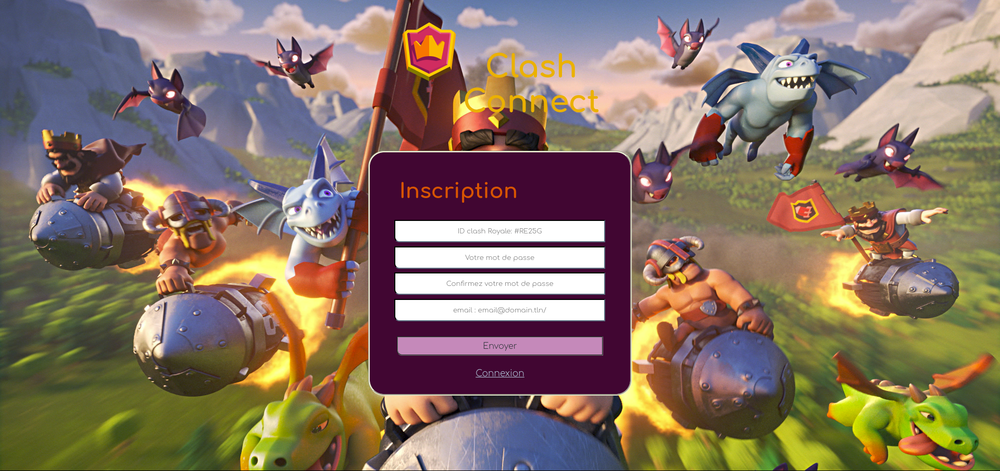
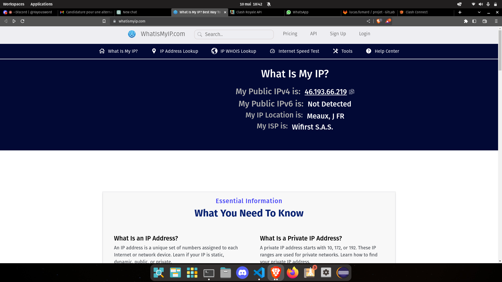

# Projet CLASH CONNECT

## Binome

Hamid KOLLI 28717594
Yanis ALAYOUD 28600748

## Description du projet et de l'API

Pour ce projet de PC3R, nous avons décidé d'utilisé l'API de Clash Royale : https://developer.clashroyale.com/#/ afin de mettre en place une sorte de réseau social permettant à différents joueurs de discuter et de consulter le détail des profils des autres, avec plusieurs informations spécifiques, trouvables grâce à l'API mentionnée ci dessus mais pas consultables directement dans le jeu.

L'API Clash Royale nous fourni énormément d'informations sur les clans, les joueurs ou encore les tournois, cependant dans le cadre de notre projet nous n'utiliserons principalement que les informations relatives aux joueurs (leurs statistiques, leur clan, leur ratio de victoires, ainsi que l'historique de leurs combats avec le résultat des combats). Notre application permettra à un utilisateur, en cliquant sur le pseudo d'un autre utilisateur, de pouvoir consulter le détail de ce profil en effectuant une requête vers l'API.

## Use-Cases

### Login :
En lançant l'application, l'utilisateur se retrouve face à une page de login :


 à partir de là il peut :

 - Se connecter en entrant son login, son mot de passe et sa clé de l'API Clash Royale (on expliquera dans une partie plus bas comment en générer un)
 - Aller vers la Page d'inscription en cliquant sur le bouton "inscription".

### Inscription :

Si l'utilisateur a cliqué sur le bouton Inscription, il est dirigé vers cette page :



à partir de là il peut :

 - Créer un nouveau compte en inscrivant l'ID Clash Royale de son compte de jeu, en entrant un mot de passe et une adresse Mail (pour l'instant vous pouvez entrer n'importe quoi pour l'email), après création il sera renvoyé vers la page de Login afin de se connecter.
 
 - Retourner vers la Page de Login en cliquant sur le bouton "inscription".

### Page principale :


Une fois connecté, l'utilisateur voit apparaitre 4 éléments principaux :

 - Un mini-profil sur la gauche donnant les informations de base du profil.
 
 - Un Chat Live sur la droite permettant de discuter avec les autres utilisateurs.
 - Le détail du profil de l'utilisateur au milieu, contenant informations détaillés, les cartes du joueur, ainsi que son historique de combat avec les résultats des combats.
 - Une barre de recherche en haut permettant de rechercher un joueur en particulier (pas forcément inscrit sur le site).
 
 Sur le Mini Profil, l'utilisateur peut cliquer sur deux boutons, un bouton "déconnexion" qui supprime les cookies et le ramène à la page de Login. Et un bouton "Détail Profil" permettant de revenir au détail de son propre profil lorsqu'il est en train d'en consulter un autre.

# Installation du projet
## Générer un token de l'API Clash Royale :

Voici les étapes à suivre pour générer votre token :

- Dirigez vous vers le site de l'API : https://developer.clashroyale.com/#/

- Créez vous un compte en allant sur Register

- Connectez vous avec Log In


- Cliquez sur votre compte en haut à droite puis sur "My Account"


- Cliquez sur "Create New Key"


- Donnez un nom et une description à votre clé


- Récupérez votre Adresse IP **Publique** (vous pouvez passer par : https://www.whatismyip.com/)



- générez ensuite votre token, c'est cette chaine de charactère que vous utiliserez pour vous login à l'application !


## Installation du reste :

Dirigez vous dans le dossier serveur :

```bash
cd serveur
```

### Installation de la base de données :
Dans le dossier serveur se trouve un script d'installation de la base de données sur Linux nommé "**bdd_install.sh**" et un autre pour wsl nommé "**bdd_launch_wsl.sh**", veuillez exécuter le script correspondant à votre machine.

### démarrage du serveur
```bash
go run main.go
```

### démarrage du client

redirigez vous vers le client
```bash
cd ../client
```

Pour installer les modules faites:
```bash
npm install
```

Pour démarrer le client:
```bash
npm start
```

Si jamais cela ne fonctionne pas, assurez-vous d'avoir au moins la Version 16.14 de NodeJs (testé entre les Versions 16 et 20).


### **Logs pouvant être utilisés si vous n'avez pas de compte Clash Royale :**

Si vous n'avez pas de compte Clash Royale, vous pouvez utiliser les ID de comptes suivants (avec le # inclus) :

#R922UG2L

ou

#VLY0PVLVL


**NB : Même si vous n'avez pas de compte clash Royale, vous pouvez vous créer un compte pour l'API, les ID sont uniquement pour se connecter à l'application, ces 2 choses ne sont pas liées**
